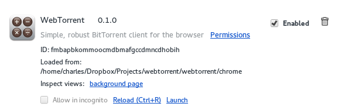

## Building
There are a couple of commands for building different parts of the project. You can see them in `package.json`.

        "build": "npm run build-css && npm run build-js",
        "build-css": "stylus --use nib css/main.styl --compress --out chrome/ && ./bin/post-build.js",
        "build-js": "browserify --debug . > chrome/bundle.js",
        "prepublish": "npm run build",
        "start": "npm run build && ./bin/start.js",
        "test": "tape test/*.js",
        "watch": "npm run watch-js & npm run watch-css",
        "watch-css": "stylus --use nib css/main.styl --out chrome/ --watch",
        "watch-js": "watchify . --outfile chrome/bundle.js --debug --verbose"
        
To build the chrome app and install it, simply run `npm start`
This will also run `bin/start.js` which will try to add the app into Chrome. this could fail for several reasons:

- you aren't using Chrome Canary on Mac
- you are running Chromium
- you are running Windows
- some weird process error

If this happens, and `chrome/bundle.js` and `chrome/main.css` exist, you can ignore the error and install it manually
by dragging the `chrome/` directory into the `chrome://extensions` page. Make sure you have enabled developer mode
in Chrome first by checking the box at the top of `chrome://extensions`.

Use the `npm watch` to automatically build when changes are made.

Use the `Reload (Ctrl-R)` button to manually reload the app after changes are made (if `npm start` is failing).

